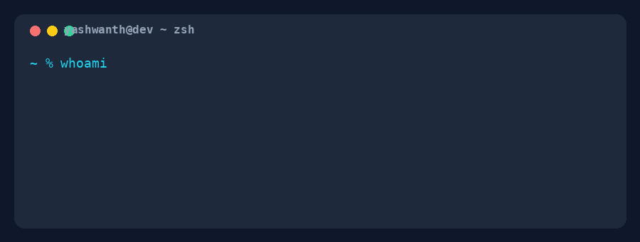

<!--
    Yashwanth Devulapally
    Student engineer · DevOps · AI automation · backend · cybersecurity
-->

  

### Main skills

### Automation & AI

`n8n` · `LLM integrations` · `AI agents` · `API integrations` · `workflow automation` · `ML/CV/NLP`

### Selected projects

  
  
  
  
  
  

### Experience
| Role | Organization | Period |
|------|-------------|--------|
| AI & Automations Intern | ParityBit Security | Apr 2026 – Jun 2026 |
| Full Stack Developer Intern | Bolt Abacus | Jun 2025 – Apr 2026 |
| Full-Stack Developer & Product Lead | TARS Networks | Jan 2025 – Apr 2026 |

**Recognition:** GDGOC APIthen 2nd place (Baymax) · Rashtrapati Nilayam AI & Robotics 3rd place · YC Startup School India · Microsoft for Startups

### Connect with me

  
  
  
  

### Recruiter?
> [!IMPORTANT]
> Reach out on [LinkedIn](https://www.linkedin.com/in/yashwanth-devulapally/) or email [yashwanthd.devulapally@gmail.com](mailto:yashwanthd.devulapally@gmail.com).

